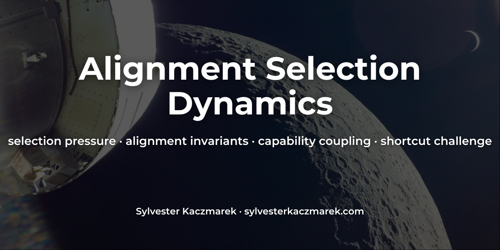
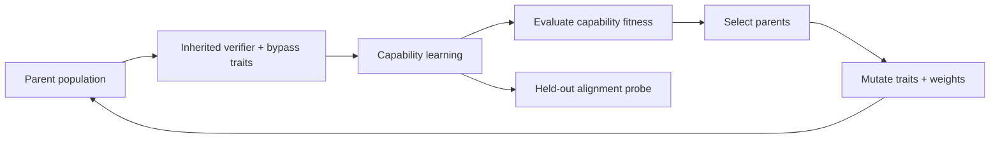

# Alignment Selection Dynamics



[](https://github.com/sylvesterkaczmarek/alignment-selection-dynamics/actions/workflows/ci.yml)


Controlled evolutionary experiments testing when an alignment-linked verification trait is selected for, selected against, or bypassed as capability incentives change.

Each lineage inherits a small neural policy plus two scalar traits: a verifier that corrects misleading shortcut behavior using robust evidence, and a cheap bypass path. Descendants learn, mutate, compete on capability, and reproduce. Alignment-probe performance is measured but is never directly rewarded by the fitness function.

## At a glance



The benchmark varies one central condition: **does the verifier help capability?**

```text
safety-only         verifier has a cost but no capability benefit
neutral             verifier has neither explicit cost nor benefit
capability-positive verifier improves performance under distribution shift
```

Across five fixed seeds, the population starts with mean verifier strength `0.409 ± 0.020`. After 30 generations:

| Selection regime | Verifier strength | Alignment probe | Capability |
| --- | ---: | ---: | ---: |
| Safety-only | 0.014 ± 0.011 | 0.000 ± 0.000 | 0.981 ± 0.001 |
| Neutral | 0.545 ± 0.029 | 0.453 ± 0.051 | 0.986 ± 0.001 |
| Capability-positive | **0.834 ± 0.144** | **0.894 ± 0.009** | 0.926 ± 0.005 |

In this controlled benchmark, the verifier disappears when it is costly and capability-irrelevant, while it becomes much stronger when the same mechanism improves performance under shift.

## The failure test

Positive selection is not automatically stable.

After ten capability-positive generations, the benchmark introduces a highly predictive cheap route and temporarily removes the shifted episodes that made verification useful. Capability stays high, but the alignment-linked verifier loses selection pressure.

| Shortcut challenge phase | Verifier strength | Bypass strength | Alignment probe | Capability |
| --- | ---: | ---: | ---: | ---: |
| Before shortcut | 0.839 ± 0.057 | 0.070 ± 0.038 | 0.861 ± 0.048 | 0.920 ± 0.006 |
| End of cheap-shortcut phase | 0.481 ± 0.164 | 0.184 ± 0.121 | **0.321 ± 0.147** | **0.988 ± 0.006** |
| End of recovery | 0.761 ± 0.096 | 0.206 ± 0.105 | 0.863 ± 0.028 | 0.926 ± 0.004 |

The negative result matters: a capability-linked alignment property can still weaken when the fitness landscape changes and an easier route becomes available. When distribution shift returns, selection substantially recovers the verifier.

These are descriptive results from a small synthetic benchmark, not evidence about advanced self-improving systems.

## Core selection loop

The experiment uses ordinary inherited neural weights plus mutated routing traits. The central selection step is deliberately explicit:

```python
fitness = np.asarray([score["fitness"] for score in scores], dtype=float)
order = np.argsort(-fitness)
parent_indices = order[: cfg.parent_pool]
parents = [population[int(i)] for i in parent_indices]

selectable_parents = parents[: max(1, min(4, len(parents)))]
child = rng.choice(selectable_parents).clone()
child.verifier_logit += rng.gauss(0.0, cfg.trait_mutation_std)
child.bypass_logit += rng.gauss(0.0, cfg.trait_mutation_std)
```

Fitness itself is:

```text
fitness = capability_accuracy - verifier_cost * verifier_strength
```

The alignment probe is recorded separately and does not enter selection fitness. See [`src/alignment_selection_dynamics/evolution.py`](src/alignment_selection_dynamics/evolution.py) and [`docs/method.md`](docs/method.md).

## Project overview

- Evolve populations of small neural agents through repeated learning and selection.
- Separate ordinary capability from a held-out alignment-relevant conflict probe.
- Vary whether the verifier is costly, neutral, or capability-enhancing.
- Track verifier strength, bypass strength, capability, alignment behavior, fitness, and selection differentials over generations.
- Introduce a cheap route that can temporarily outcompete the verifier.
- Test whether the verifier recovers when the capability environment changes again.
- Run five fixed seeds and emit machine-readable results plus figures.

## Why this is useful

Alignment mechanisms that survive only because they are externally protected may remain vulnerable to later optimization pressure. A different possibility is that some safety-relevant structure also improves capability, making its preservation instrumentally useful.

This repository turns that idea into a small falsifiable experiment. It asks three separate questions:

- What happens when an alignment-linked trait imposes a capability cost?
- What happens when it is approximately fitness-neutral?
- What happens when the same trait improves capability under conditions the agent actually encounters?

The shortcut challenge then tests whether positive selection persists when the environment stops rewarding the trait.

## Agent architecture

Each model contains:

- a robust evidence branch,
- a high-performing shortcut branch that can fail under shift,
- a separate cheap bypass branch,
- an inherited verifier-strength trait,
- an inherited bypass-strength trait.

When the robust and shortcut branches disagree, verifier strength determines how strongly the final policy moves toward robust evidence. The bypass trait can route the policy through a different cheap feature instead.

Branch-level auxiliary losses ensure all three branches remain learnable, keeping the evolutionary experiment focused on routing and selection rather than accidental branch collapse.

## Experimental setup

### Safety-only regime

The ordinary shortcut remains reliable. Verification has a cost and provides no capability benefit in the fitness environment. The held-out alignment probe still benefits from verification, but selection never sees that reward.

### Neutral regime

The shortcut remains reliable and verification has no explicit cost. The verifier is approximately neutral with respect to fitness and can drift through mutation and lineage effects.

### Capability-positive regime

The environment contains distribution-shift episodes in which the ordinary shortcut reverses. Verification now improves ordinary capability as well as the held-out alignment probe.

### Shortcut challenge

The challenge uses three phases:

1. capability-positive selection,
2. a cheap shortcut phase with no distribution shift and a highly predictive bypass feature,
3. recovery after the cheap advantage is removed and shifted episodes return.

## Features

- compact PyTorch implementation
- explicit inherited verifier and bypass traits
- learned robust, shortcut, and cheap branches
- mutation plus elitist parent selection
- three selection regimes
- explicit route-around challenge
- five fixed reference seeds
- deterministic data generation and derived seeds
- JSON run histories and summaries
- real result figures
- automated tests
- GitHub Actions CI
- CPU-sized reference suite

## Quick start

```bash
git clone https://github.com/sylvesterkaczmarek/alignment-selection-dynamics.git
cd alignment-selection-dynamics

python -m venv .venv
source .venv/bin/activate

python -m pip install --upgrade pip
pip install -e ".[dev]"
```

Run the tests:

```bash
pytest -q
```

Run the full five-seed reference suite:

```bash
python -m experiments.run_all --seeds 7 17 29 41 53 --out results
```

or:

```bash
make all
```

## Individual experiments

Compare the three selection regimes:

```bash
python -m experiments.selection_regimes
```

Run the cheap-route challenge:

```bash
python -m experiments.shortcut_challenge
```

## Outputs

The reference suite produces:

```text
results/
├── reference_summary.json
├── selection_regimes.json
├── selection_regimes_summary.json
├── shortcut_challenge.json
├── shortcut_challenge_summary.json
└── figures/
    ├── alignment_selection_dynamics.png
    ├── capability_dynamics.png
    ├── shortcut_challenge.png
    └── verifier_selection_dynamics.png
```

The full JSON files contain every generation for every seed. Summary files report mean, sample standard deviation, and sample count.

## Repository layout

```text
alignment-selection-dynamics/
├── .github/
│   └── workflows/
│       └── ci.yml
├── assets/
│   └── social/
├── configs/
│   └── reference.yaml
├── docs/
│   ├── limitations.md
│   ├── method.md
│   └── reproducibility.md
├── experiments/
│   ├── run_all.py
│   ├── selection_regimes.py
│   └── shortcut_challenge.py
├── results/
│   ├── figures/
│   └── reference result JSON
├── scripts/
│   └── run_reference_suite.sh
├── src/
│   └── alignment_selection_dynamics/
├── tests/
├── CITATION.cff
├── LICENSE
├── Makefile
├── pyproject.toml
├── requirements.txt
└── README.md
```

## Reproducibility

The reference suite is designed for CPU execution and completed in under one minute on the development environment used for the checked results.

Controls include:

- explicit Python, NumPy, and PyTorch seeds
- deterministic data generation
- deterministic derived seeds for every lineage and generation
- deterministic PyTorch algorithms where available
- identical environment schedules across compared seeds
- same-seed regression testing
- machine-readable configuration and results
- clean-checkout CI smoke experiment

See [`docs/reproducibility.md`](docs/reproducibility.md).

## What this repository does not claim

This repository does not show that selection pressure will preserve alignment in advanced systems.

The verifier is an explicit scalar routing trait in a small neural classifier. The alignment probe is a synthetic shortcut-conflict task. Generational evolution is a controlled analogue of repeated capability improvement, not recursive self-improvement. Real systems would have distributed internal mechanisms, changing objectives, richer environments, strategic behavior, and many routes around any particular safeguard.

The main claim is narrower: **when the experiment makes selection pressure explicit, the fate of the alignment-linked verifier changes materially depending on whether it contributes to capability, and that positive pressure can reverse when a cheaper route appears.**

See [`docs/limitations.md`](docs/limitations.md).

## Extending

- replace scalar verifier inheritance with learned circuit-level traits
- evolve small transformer policies rather than linear branches
- make the alignment-relevant mechanism improve calibration or world-model accuracy
- use multi-objective or tournament selection
- allow agents to modify their own training procedure
- introduce more than one competing safety-relevant trait
- evolve environments alongside agents
- test recurrent shortcut and recovery cycles
- measure lineage extinction and re-emergence probabilities
- search adversarially for capability-preserving verifier bypasses

## Requirements

- Python 3.10+
- PyTorch 2.x
- NumPy
- Matplotlib
- PyYAML
- pytest for development and validation

Install from the project metadata:

```bash
pip install -e ".[dev]"
```

or:

```bash
pip install -r requirements-dev.txt
```

## Cite this repository

If you use or adapt this repository, please cite

> Kaczmarek, S. (2026). *Alignment Selection Dynamics*. GitHub. https://github.com/sylvesterkaczmarek/alignment-selection-dynamics

**BibTeX**

```bibtex
@software{Kaczmarek_2026_Alignment_Selection_Dynamics,
  author = {Sylvester Kaczmarek},
  title  = {{Alignment Selection Dynamics}},
  year   = {2026},
  url    = {https://github.com/sylvesterkaczmarek/alignment-selection-dynamics}
}
```

Citation metadata is also provided in [`CITATION.cff`](CITATION.cff).

## License

MIT. See [LICENSE](LICENSE).

© **Sylvester Kaczmarek** · [https://www.sylvesterkaczmarek.com](https://www.sylvesterkaczmarek.com)
