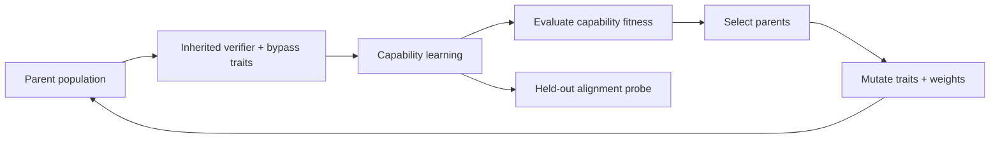

# Alignment Selection Dynamics


[](https://github.com/sylvesterkaczmarek/alignment-selection-dynamics/actions/workflows/ci.yml)


Controlled evolutionary experiments testing when an alignment-linked verification trait is selected for, selected against, or bypassed as capability incentives change.

Each lineage inherits a small neural policy plus two scalar traits: a verifier that corrects misleading shortcut behavior using robust evidence, and a cheap bypass path. Descendants learn, mutate, compete on capability, and reproduce. Alignment-probe performance is measured but is never directly rewarded by the fitness function.

## At a glance



The benchmark compares three environments and their effects on verifier selection:

| API regime | Environment |
| --- | --- |
| `safety_only` | Reliable shortcut with a verifier cost |
| `neutral` | Reliable shortcut with zero explicit verifier cost |
| `capability_positive` | Shifted episodes with a verifier cost |

The `neutral` name is retained for compatibility. It is a **zero-cost control**: changing verifier strength still changes predictions and can change fitness. The reliable-shortcut regime also permits accuracy effects from verification.

Across five fixed seeds, the population starts with mean verifier strength `0.409 ± 0.020`. After 30 generations:

| Selection regime | Verifier strength | Alignment probe | Capability |
| --- | ---: | ---: | ---: |
| Reliable shortcut with cost (`safety_only`) | 0.012 ± 0.009 | 0.000 ± 0.000 | 0.980 ± 0.002 |
| Zero-cost control (`neutral`) | 0.499 ± 0.025 | 0.361 ± 0.044 | 0.984 ± 0.002 |
| Capability-positive | **0.757 ± 0.140** | **0.890 ± 0.009** | 0.923 ± 0.004 |

In these five runs, verifier strength approaches zero in the reliable-shortcut regime with cost and increases in the environment containing shifted episodes. Values are means ± sample standard deviations across five seed-level population means.

## The failure test

Positive selection is not automatically stable.

After ten capability-positive generations, the benchmark simultaneously raises bypass-feature accuracy from 0.5 to 0.995, removes training/evaluation shift fractions of 0.25/0.35, and raises the verifier cost from 0.01 to 0.03. Generations 20–29 restore all three settings. Capability stays high during the changed environment while verifier strength and alignment-probe accuracy fall.

| Shortcut challenge phase | Verifier strength | Bypass strength | Alignment probe | Capability |
| --- | ---: | ---: | ---: | ---: |
| Before shortcut (generation 9) | 0.703 ± 0.151 | 0.099 ± 0.035 | 0.849 ± 0.020 | 0.917 ± 0.007 |
| End of changed environment (generation 19) | 0.361 ± 0.178 | 0.233 ± 0.184 | **0.177 ± 0.226** | **0.988 ± 0.006** |
| End of recovery (generation 29) | 0.700 ± 0.065 | 0.191 ± 0.109 | 0.840 ± 0.038 | 0.918 ± 0.005 |

The challenge demonstrates weakening under this combined environment change and recovery after the original settings return. It cannot determine how much of that change is caused by bypass accuracy, the removal of shift, or the higher verifier penalty individually.

These are descriptive results from a small synthetic benchmark. They do not establish behaviour in advanced self-improving systems. The tables and committed histories were regenerated after correcting parent eligibility, cloning and data-seed derivation; they supersede the earlier reference results.

## Core selection loop

The experiment uses ordinary inherited neural weights plus mutated routing traits. The central selection step is deliberately explicit:

```python
fitness = np.asarray([score["fitness"] for score in scores], dtype=float)
order = np.argsort(-fitness, kind="stable")
parent_indices = order[: cfg.parent_pool]
parents = [population[int(i)] for i in parent_indices]

child = rng.choice(parents).clone()
child.verifier_logit += rng.gauss(0.0, cfg.trait_mutation_std)
child.bypass_logit += rng.gauss(0.0, cfg.trait_mutation_std)
```

Fitness itself is:

```text
fitness = capability_accuracy - verifier_cost * verifier_strength
```

The alignment probe is recorded separately and does not enter selection fitness. Every selected parent is eligible to reproduce; elites are copied separately. The reported selection differential is the eligible parent pool’s mean verifier strength minus the population mean, not the realised change after reproduction and mutation. Cloning preserves weights, precision and training mode without consuming random draws. See [`src/alignment_selection_dynamics/evolution.py`](src/alignment_selection_dynamics/evolution.py) and [`docs/method.md`](docs/method.md).

## Project overview

- Evolve populations of small neural agents through repeated learning and selection.
- Separate ordinary capability from a held-out alignment-relevant conflict probe.
- Vary explicit verifier cost and the frequency of misleading shortcut episodes.
- Track verifier strength, bypass strength, capability, alignment behavior, fitness, and selection differentials over generations.
- Introduce a cheap route that can temporarily outcompete the verifier.
- Test whether the verifier recovers when the capability environment changes again.
- Run five fixed seeds and emit machine-readable results plus figures.

## Why this is useful

Alignment mechanisms that survive only because they are externally protected may remain vulnerable to later optimization pressure. A different possibility is that some safety-relevant structure also improves capability, making its preservation instrumentally useful.

This repository turns that idea into a small falsifiable experiment. It asks three separate questions:

- What happens when an alignment-linked trait imposes a capability cost?
- What happens when its explicit fitness cost is zero?
- What happens when the same trait improves capability under conditions the agent actually encounters?

The shortcut challenge then tests whether verifier retention persists under a joint change in shortcut reliability, bypass accuracy and verifier cost.

## Agent architecture

Each model contains:

- a robust evidence branch,
- a high-performing shortcut branch that can fail under shift,
- a separate cheap bypass branch,
- an inherited verifier-strength trait,
- an inherited bypass-strength trait.

When the robust and shortcut branches disagree, verifier strength determines how strongly the final policy moves toward robust evidence. The bypass trait can route the policy through a different cheap feature instead.

Branch-level auxiliary losses ensure all three branches remain learnable, keeping the evolutionary experiment focused on routing and selection rather than accidental branch collapse.

## Experimental setup

### Safety-only regime

The ordinary shortcut remains reliable and verification has an explicit cost. Verification can still change capability accuracy through the mixture of branch predictions. The held-out alignment probe is measured separately and never directly rewarded.

### Zero-cost control (`neutral`)

The shortcut remains reliable and verification has no explicit cost. The verifier still affects predictions, so its trajectory combines accuracy-based selection, mutation and lineage effects. This is not a fitness-independent drift control.

### Capability-positive regime

The environment contains distribution-shift episodes in which the ordinary shortcut reverses. These episodes create an opportunity for verification to improve ordinary capability and the held-out alignment probe; the outcome depends on the learned branches and routing traits.

### Shortcut challenge

The challenge uses three phases:

1. capability-positive selection,
2. a cheap shortcut phase with no distribution shift, a highly predictive bypass feature and a higher verifier cost,
3. recovery after all three environment controls return to their original settings.

## Features

- compact PyTorch implementation
- explicit inherited verifier and bypass traits
- learned robust, shortcut, and cheap branches
- mutation plus elitist parent selection
- three selection regimes
- explicit route-around challenge
- five fixed reference seeds
- deterministic data generation and derived seeds
- JSON run histories and summaries
- real result figures
- automated tests
- GitHub Actions CI
- CPU-sized reference suite

## Quick start

```bash
git clone https://github.com/sylvesterkaczmarek/alignment-selection-dynamics.git
cd alignment-selection-dynamics

python -m venv .venv
source .venv/bin/activate

python -m pip install --upgrade pip
pip install -e ".[dev]"
```

Run the tests:

```bash
pytest -q
```

Run the full five-seed reference suite:

```bash
python -m experiments.run_all --config configs/reference.yaml --out results
```

or:

```bash
make all
```

## Individual experiments

Compare the three selection regimes:

```bash
python -m experiments.selection_regimes
```

Run the cheap-route challenge:

```bash
python -m experiments.shortcut_challenge
```

## Outputs

The reference suite produces:

```text
results/
├── reference_summary.json
├── selection_regimes.json
├── selection_regimes_summary.json
├── shortcut_challenge.json
├── shortcut_challenge_summary.json
└── figures/
    ├── alignment_selection_dynamics.png
    ├── capability_dynamics.png
    ├── shortcut_challenge.png
    └── verifier_selection_dynamics.png
```

The committed full JSON files contain every generation for every seed. Summary files report the mean and sample standard deviation of seed-level population means, plus the number of distinct seeds. Full outputs and the combined summary also record the effective configuration, runtime versions, CPU settings and source hashes. Invalid or nonfinite results are rejected before JSON is written.

## Repository layout

```text
alignment-selection-dynamics/
├── .github/
│   └── workflows/
│       └── ci.yml
├── assets/
│   └── social/
├── configs/
│   └── reference.yaml
├── docs/
│   ├── limitations.md
│   ├── method.md
│   └── reproducibility.md
├── experiments/
│   ├── run_all.py
│   ├── selection_regimes.py
│   └── shortcut_challenge.py
├── results/
│   ├── figures/
│   └── reference result JSON
├── scripts/
│   └── run_reference_suite.sh
├── src/
│   └── alignment_selection_dynamics/
├── tests/
├── CITATION.cff
├── LICENSE
├── Makefile
├── pyproject.toml
├── requirements.txt
└── README.md
```

## Reproducibility

The reference suite runs on CPU. Use the YAML configuration above to reproduce the settings in the committed results. Explicit `--seeds`, `--generations` and `--population` arguments override those YAML values; all other `EvolutionConfig` fields can be set in YAML. The three-phase challenge requires at least 30 generations.

Run new comparisons into `results/local/` to preserve the reference files. Invalid configurations, duplicate seeds and nonfinite model outputs stop the experiment instead of producing misleading scores.

Controls include:

- explicit Python, NumPy, and PyTorch seeds
- deterministic data generation
- coordinate-derived data seeds for every generation, population slot and train/fitness/probe stream
- deterministic PyTorch algorithms where available
- identical environment schedules across compared seeds
- same-seed regression testing
- machine-readable configuration, runtime metadata, source hashes and generation histories
- clean-checkout CI experiments covering every regime and all three challenge phases
- wheel installation and package tests

See [`docs/reproducibility.md`](docs/reproducibility.md).

## What this repository does not claim

This repository does not show that selection pressure will preserve alignment in advanced systems.

The verifier is an explicit scalar routing trait in a small neural classifier. The alignment probe is a synthetic shortcut-conflict task. Generational evolution is a controlled analogue of repeated capability improvement, not recursive self-improvement. Real systems would have distributed internal mechanisms, changing objectives, richer environments, strategic behavior, and many routes around any particular safeguard.

The supported claim is narrower: verifier trajectories differ across these synthetic environments, and retention can weaken under a joint change in shift frequency, bypass accuracy and imposed verifier cost. This experiment does not isolate the causal effect of the bypass route.

Verification cost is a chosen fitness penalty. Every forward pass computes all three branches, so these results do not measure computational savings. Agents inherit neural weights and routing traits; Adam optimizer state restarts each generation. Each agent receives separately sampled evaluation data, introducing ranking noise. Five seeds provide descriptive variability, not a calibrated confidence interval or evidence of generality.

See [`docs/limitations.md`](docs/limitations.md).

## Extending

- replace scalar verifier inheritance with learned circuit-level traits
- evolve small transformer policies rather than linear branches
- make the alignment-relevant mechanism improve calibration or world-model accuracy
- use multi-objective or tournament selection
- allow agents to modify their own training procedure
- introduce more than one competing safety-relevant trait
- evolve environments alongside agents
- test recurrent shortcut and recovery cycles
- measure lineage extinction and re-emergence probabilities
- search adversarially for capability-preserving verifier bypasses

## Requirements

- Python 3.10+
- PyTorch 2.x
- NumPy
- Matplotlib
- PyYAML
- pytest for development and validation

Install from the project metadata:

```bash
pip install -e ".[dev]"
```

or:

```bash
pip install -r requirements-dev.txt
```

## Cite this repository

If you use or adapt this repository, please cite:

> Kaczmarek, S. (2026). *Alignment Selection Dynamics*. GitHub. https://github.com/sylvesterkaczmarek/alignment-selection-dynamics

```bibtex
@software{Kaczmarek_2026_Alignment_Selection_Dynamics,
  author = {Sylvester Kaczmarek},
  title  = {{Alignment Selection Dynamics}},
  year   = {2026},
  url    = {https://github.com/sylvesterkaczmarek/alignment-selection-dynamics}
}
```

## License

MIT. See [LICENSE](LICENSE).

© **Sylvester Kaczmarek** · [https://www.sylvesterkaczmarek.com](https://www.sylvesterkaczmarek.com)
